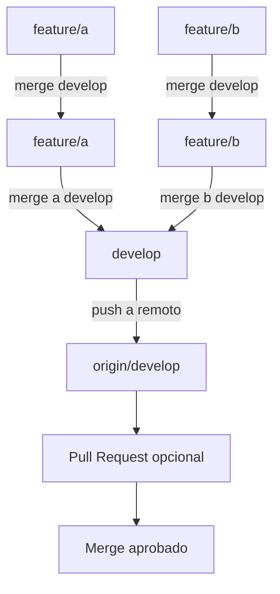

# 🗡 Guía de Integración de Features a Develop con Git (paso a paso)

Este documento explica cómo mantener actualizadas las ramas de desarrollo (`feature/a`, `feature/b`) con la rama principal `develop`, y luego cómo integrarlas correctamente. Todos los pasos están pensados para ejecutarse en **Git Bash en VSCode sobre Windows**.

---

## 📈 Diagrama del flujo de trabajo



---

## ✅ 1. Traer cambios remotos (`fetch`)

```bash
git fetch origin
```

> Trae los últimos cambios del repositorio remoto sin aplicarlos aún.

---

## ✅ 2. Actualizar `feature/a` con `develop`

```bash
git checkout feature/a
git merge origin/develop
# Resolver conflictos si aparecen:
git add .
git commit -m "fix: resolviendo conflictos con develop"
git push origin feature/a
```

---

## ✅ 3. Actualizar `feature/b` con `develop`

```bash
git checkout feature/b
git merge origin/develop
# Resolver conflictos si aparecen:
git add .
git commit -m "fix: resolviendo conflictos con develop"
git push origin feature/b
```

---

## ✅ 4. Cambiar a `develop` y traer cambios

```bash
git checkout develop
git pull origin develop
```

---

## ✅ 5. Hacer merge de `feature/a` a `develop`

```bash
git merge feature/a
git push origin develop
```

---

## ✅ 6. Hacer merge de `feature/b` a `develop`

```bash
git merge feature/b
git push origin develop
```

---

## ✅ 7. (Opcional) Borrar ramas feature ya integradas

### 🧼 Recomendación: hacer pull antes de borrar

Si hiciste el merge desde GitHub, tu rama local `develop` puede estar desactualizada. Para evitar errores:

```bash
git checkout develop
git pull origin develop
```

Luego:

```bash
git branch -d feature/a
```

Si estás absolutamente seguro de que el merge fue hecho y validado:

```bash
git branch -D feature/a  # Forzado
```

Repetir para `feature/b`.

```bash
git branch -d feature/b
```

---

## ✅ Resultado final

La rama `develop` contiene ahora todos los cambios de `feature/a` y `feature/b`, y está lista para pruebas o próximos lanzamientos.

---

## 🧩 Ejemplo real: resolución de conflicto en archivo Markdown

Durante un merge en la rama `feature/architecture-system`, se detectó un conflicto en el archivo:

```
edge-node/docs/architecture-edge.md
```

Para resolverlo:

1. Se abrió el archivo y se combinaron manualmente los contenidos más recientes, priorizando la versión local mejorada que incluía una explicación completa de la arquitectura Edge + MQTT.
2. Se marcó como resuelto con:

```bash
git add edge-node/docs/architecture-edge.md
```

3. Se finalizó el merge con:

```bash
git commit -m "fix(docs): resuelto conflicto de architecture-edge.md al integrar cambios de develop"
```

4. Se subieron los cambios:

```bash
git push origin feature/architecture-system
```

✅ Con esto, el conflicto quedó resuelto de forma limpia y documentada.

---

## 🔀 Crear Pull Request en GitHub

Una vez que una rama `feature/*` está lista y pusheada:

1. Ir al repositorio en GitHub.
2. Hacer clic en el botón “Compare & pull request”.
3. **IMPORTANTE:** cambiar la base (`base:`) a `develop`, no a `main`.
4. Revisar los cambios propuestos.
5. Crear el PR con título y descripción clara.
6. Si Git indica `There isn’t anything to compare.`, es porque el merge ya fue hecho localmente.

---

## ✅ Casos reales documentados

* Se creó y mergeó exitosamente el PR `feature/architecture-system → develop`, resolviendo un conflicto en `architecture-edge.md`.
* La rama `feature/project-intructions` ya había sido mergeada manualmente a `develop`, y GitHub mostró el mensaje `develop is up to date with all commits from feature/project-intructions`.

📌 En ambos casos se limpió el repositorio, se confirmaron los cambios en GitHub y se mantuvo la documentación al día.

---

## 🧩 Error común: "MERGE\_HEAD exists"

Cuando aparece este error:

```
fatal: You have not concluded your merge (MERGE_HEAD exists).
```

Significa que hay un merge iniciado (probablemente con conflictos resueltos) que aún no fue finalizado. Git no permite comenzar otro merge hasta que lo termines.

### ✅ Solución:

1. Completá el merge pendiente:

```bash
git commit -m "fix(docs): finaliza merge de develop en feature/readme"
```

2. Ahora podés seguir normalmente:

```bash
git merge origin/develop
```
