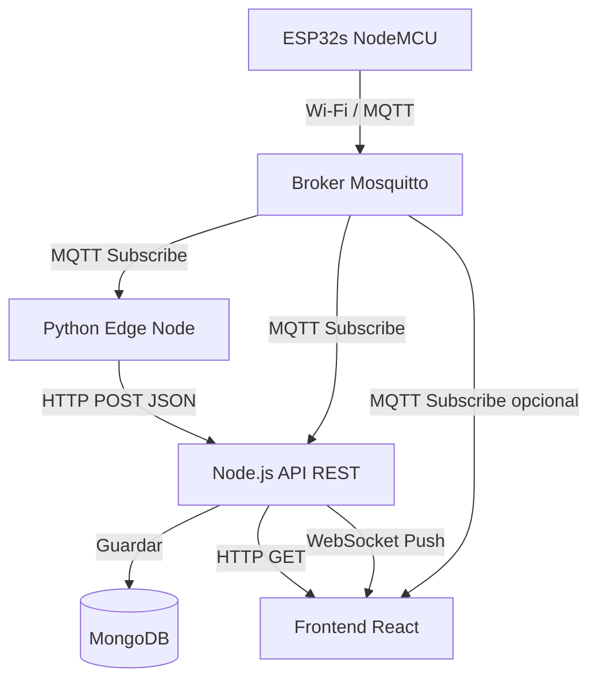

# 🧪 Proyecto: Sistema de Medición para Indoor

## 🎯 Descripción General

Este proyecto tiene como objetivo el desarrollo de un sistema de medición ambiental integral para un entorno indoor. El foco inicial está puesto en la implementación del software (backend, frontend y nodo Edge) y en la incorporación de una **arquitectura combinada REST + MQTT**, junto con la estructura del servidor y su documentación paso a paso.

Todo el desarrollo se realiza sobre **Windows**, utilizando **Git Bash en Visual Studio Code**. Cada línea de código propuesta debe incluir comentarios detallados para facilitar la comprensión y acelerar el aprendizaje.

Se documentan todos los pasos realizados en archivos `.md`, los cuales sirven de base para futuras incorporaciones y mejoras del sistema.

## 🛠️ Tecnologías Utilizadas

* **Backend:** Node.js + Express
* **Frontend:** React + Redux
* **Base de Datos:** MongoDB
* **Broker MQTT:** Mosquitto
* **Comunicación y Servicios:** HTTP, MQTT, SSH

## 📌 Objetivos del Proyecto

* Diseñar una arquitectura robusta, modular y extensible para el monitoreo de variables ambientales.
* Incorporar un **broker MQTT** centralizado para mensajería en tiempo real y mantener la API REST para histórico y configuración.
* Priorizar calidad, escalabilidad y separación de responsabilidades desde el inicio.
* Documentar detalladamente todo el proceso técnico y conceptual del desarrollo.

## 🧰 Metodología de Trabajo

* **Git como eje de control:** Todas las etapas del proyecto se versionan y documentan con Git.
* **Documentación continua:** Cada configuración o desarrollo se registra en Markdown.
* **Buenas prácticas:** Uso de convenciones, nombres claros, estructura modular y patrones de arquitectura limpia.
* **Comentarios en el código:** Cada línea de código debe incluir comentarios explicativos para entender rápidamente la lógica y su propósito.

## 🤖 Rol de ChatGPT en el Proyecto

* Acompañar el proceso técnico y asesorar en decisiones de arquitectura.
* Explicar paso a paso cada implementación y configuración.
* Ayudar a estructurar y actualizar la documentación del proyecto.
* Sugerir mejoras continuas en código, organización y estructura.

---

# 🏗️ Arquitectura del Proyecto Indoor

## 📦 Enfoque Arquitectónico

Se adopta una **arquitectura modular Cliente-Servidor con lógica Edge Computing**, extendida con un **broker MQTT centralizado (Mosquitto)** para mensajería en tiempo real.

### 🔄 Distribución de Componentes

| Componente                  | Rol principal                                                                    |
| --------------------------- | -------------------------------------------------------------------------------- |
| **ESP32s NodeMCU**          | Mide sensores físicos y publica datos vía MQTT al broker                         |
| **Broker MQTT (Mosquitto)** | Enruta mensajes entre publishers y subscribers                                   |
| **Python (Edge Node)**      | Suscriptor MQTT: filtra, transforma y reenvía datos a la API REST                |
| **Node.js (API REST)**      | Suscriptor MQTT: guarda históricos en MongoDB, expone endpoints REST y WebSocket |
| **React + Redux**           | Suscriptor WebSocket/MQTT: consume histórico por REST y datos en tiempo real     |

### 🔧 Flujo General del Sistema



## 🧱 Arquitectura Interna Sugerida (Clean Architecture)

* `controllers/`: Controladores de entrada (Express, handlers de Python)
* `usecases/`: Lógica de negocio o servicios de aplicación
* `repositories/`: Acceso a datos (MongoDB, otros servicios)
* `entities/`: Modelos del dominio (por ejemplo: SensorData)

## 🔭 Futuras Extensiones Posibles

* Autenticación y TLS en MQTT para mayor seguridad.
* Dashboard avanzado (Grafana, Dash).
* Notificaciones por email o Telegram.
* Contenerización de servicios (Docker).

---

# 🔀 Flujo de trabajo Git basado en Git Flow (sin herramienta externa)

Este documento define la estrategia de ramas para el proyecto `indoor-system`, siguiendo el enfoque de **Git Flow manual**, sin necesidad de herramientas externas.

## 📌 Convenciones de ramas

| Tipo de rama | Prefijo    | Propósito                                     |
| ------------ | ---------- | --------------------------------------------- |
| `main`       | —          | Rama estable, lista para producción           |
| `develop`    | —          | Rama de integración de features y testing     |
| `feature/*`  | `feature/` | Desarrollo de nuevas funcionalidades          |
| `bugfix/*`   | `bugfix/`  | Corrección de errores detectados en `develop` |
| `hotfix/*`   | `hotfix/`  | Corrección urgente sobre `main`               |
| `release/*`  | `release/` | Preparación para nuevos lanzamientos estables |

## 🚀 Flujo de desarrollo habitual

```bash
# 1. Partimos siempre desde develop
git checkout develop

# 2. Creamos una rama de feature
git checkout -b feature/nombre-corto-descriptivo

# 3. Trabajamos normalmente en la rama
git add .
git commit -m "feat(módulo): breve descripción del cambio"

# 4. Subimos la rama al remoto
git push origin feature/nombre-corto-descriptivo

# 5. Cuando finaliza la feature, hacemos merge a develop
git checkout develop
git pull
git merge feature/nombre-corto-descriptivo

# 6. Eliminamos la rama si ya no se usará
git branch -d feature/nombre-corto-descriptivo
git push origin --delete feature/nombre-corto-descriptivo
```

## ✅ Buenas prácticas

* Usar **nombres descriptivos y concisos** para las ramas.
* Aplicar **commits semánticos**:

  * `feat`: nueva funcionalidad
  * `fix`: corrección de error
  * `docs`: cambios en documentación
  * `refactor`: mejora del código sin cambio funcional
  * `test`: pruebas
  * `chore`: mantenimiento general
* Incluir el nombre del módulo o área afectada entre paréntesis.

  * Ej: `feat(api): agrega endpoint de lectura`
* Mantener los PR simples, con un solo objetivo por rama.

## 📁 Ubicación sugerida

Este contenido debe guardarse como:

```
/docs/project-instructions.md
```

---

> Adaptate a trabajar teniendo en cuenta las limitaciones de hardware (`Limitaciones.md`).
> Cada línea de código que propongas debe incluir comentarios detallados para entender mejor todo y más rápido.
> 🔁 Este documento será actualizado y ampliado a medida que el proyecto avance.
