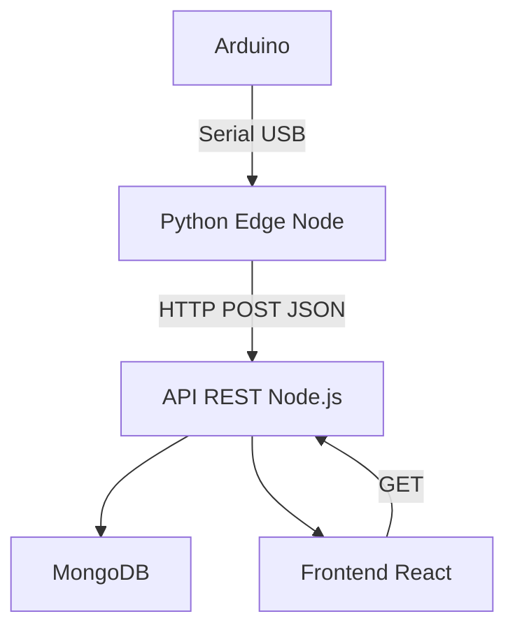

# 🐍 Guía Rápida de Python para el Proyecto Edge-Node

## 1. Instalación y Preparación del Entorno

### ✅ Requisitos en Windows

* Python 3.10+ desde [https://www.python.org/downloads/windows/](https://www.python.org/downloads/windows/)
* Editor: Visual Studio Code (VSCode)
* Terminal: Git Bash

### ✅ Verificación de instalación

```bash
py --version  # Verifica versión de Python instalada
# o bien
python --version
```

### ✅ Crear entorno virtual

```bash
cd edge-node                 # Entrar al directorio del nodo Edge
py -m venv venv              # Crear entorno virtual llamado 'venv'
source venv/Scripts/activate # Activar entorno virtual (en Git Bash)
```

### ✅ Instalar dependencias

```bash
pip install requests pyserial python-dotenv  # Librerías necesarias
pip freeze > requirements.txt                # Guarda versiones instaladas
```

### ✅ Estructura inicial

```
edge-node/
├── main.py                # Programa principal del nodo Edge
├── config/
│   └── settings.py        # Configuraciones generales
├── services/
│   ├── serial_reader.py   # Módulo de lectura del puerto serial
│   └── http_client.py     # Cliente HTTP para enviar datos al backend
├── entities/
│   └── sensor_data.py     # Representación estructurada de datos
├── .env                   # Variables de entorno
├── requirements.txt       # Lista de dependencias
```

---

## 2. Sintaxis Básica de Python (para programadores)

```python
"""Comentario multilínea explicativo"""

# Variables
valor = 42                        # Entero
mensaje = "Hola"                  # String
valores = [1, 2, 3]               # Lista

# Condicionales
if valor > 50:
    print("Mayor a 50")           # Se imprime si se cumple la condición
elif valor == 42:
    print("La respuesta")         # Se imprime si valor es igual a 42
else:
    print("Otro")                 # Se ejecuta si no se cumplen las anteriores

# Bucles
for i in range(5):                # Itera de 0 a 4
    print(i)

while True:
    break                         # Rompe el bucle inmediatamente

# Funciones definidas por el usuario
def saludar(nombre):
    return f"Hola, {nombre}"      # Devuelve un saludo personalizado

# Clases
class Sensor:
    def __init__(self, tipo):
        self.tipo = tipo          # Guarda el tipo de sensor

    def leer(self):
        return f"Leyendo sensor {self.tipo}"  # Método de lectura simulado
```

---

## 3. Primer Script del Nodo Edge (Python + Arduino)

### main.py

```python
from services.serial_reader import leer_datos_arduino  # Importa función para leer del puerto serial
from services.http_client import enviar_a_backend       # Importa función para enviar datos por HTTP
import time                                             # Para hacer pausas entre ciclos

while True:                                             # Bucle infinito
    datos = leer_datos_arduino()                       # Lee una línea desde el Arduino
    if datos:                                          # Si se recibió algo...
        enviar_a_backend(datos)                        # ... lo envía al backend
    time.sleep(1)                                      # Espera 1 segundo antes de repetir
```

### services/serial\_reader.py

```python
import serial                                           # Módulo para trabajar con puertos seriales
SERIAL_PORT = "COM3"                                   # Puerto usado por Arduino en Windows
BAUD_RATE = 9600                                       # Velocidad de comunicación
ser = serial.Serial(SERIAL_PORT, BAUD_RATE, timeout=1) # Inicializa conexión serial con timeout

def leer_datos_arduino():
    try:
        linea = ser.readline().decode('utf-8').strip() # Lee y decodifica la línea recibida
        if linea:
            print(f"[SERIAL] {linea}")                 # Muestra lo que se leyó
            return {"lectura": linea}                  # Devuelve en forma de diccionario
    except Exception as e:
        print(f"[ERROR SERIAL] {e}")                   # Informa errores de lectura
    return None
```

### services/http\_client.py

```python
import requests                                         # Librería para hacer peticiones HTTP
import os                                               # Para acceder a variables de entorno
from dotenv import load_dotenv                         # Para cargar el archivo .env

load_dotenv()                                           # Carga las variables desde .env
API_URL = os.getenv("API_URL")                         # Obtiene URL del backend desde .env

def enviar_a_backend(data):
    try:
        response = requests.post(API_URL, json=data)   # Envía los datos como JSON por POST
        print(f"[HTTP] {response.status_code}: {response.text}")  # Muestra respuesta del servidor
    except Exception as e:
        print(f"[ERROR HTTP] {e}")                      # Muestra error si la petición falla
```

---

## 4. Arquitectura Edge-Node (resumen conceptual)

### 🧱 Componentes

| Componente         | Rol                                     |
| ------------------ | --------------------------------------- |
| Arduino            | Lectura de sensores por puerto serial   |
| Raspberry (Python) | Nodo Edge: transforma, filtra y reenvía |
| Node.js API        | Valida y almacena en MongoDB            |
| React              | Dashboard de visualización              |

### ♻️ Flujo



### 🧠 Ventajas

* Permite decisiones locales sin depender de la red
* Bajo consumo de recursos
* Sistema modular y escalable

---

## 5. Buenas prácticas

* Activar `venv` antes de cada sesión
* Usar `.env` para configurar IP y claves
* Documentar con comentarios y Markdown
* Validar puerto serial antes de correr

---

> Esta guía es la base para comenzar a trabajar en el nodo Edge del sistema de monitoreo indoor. Recomendado integrar esto en `docs/python-edge-guide.md`.
